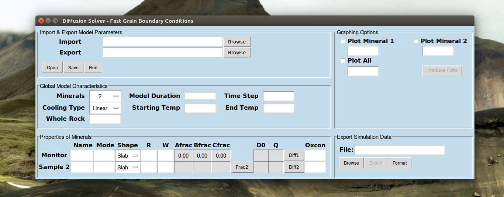
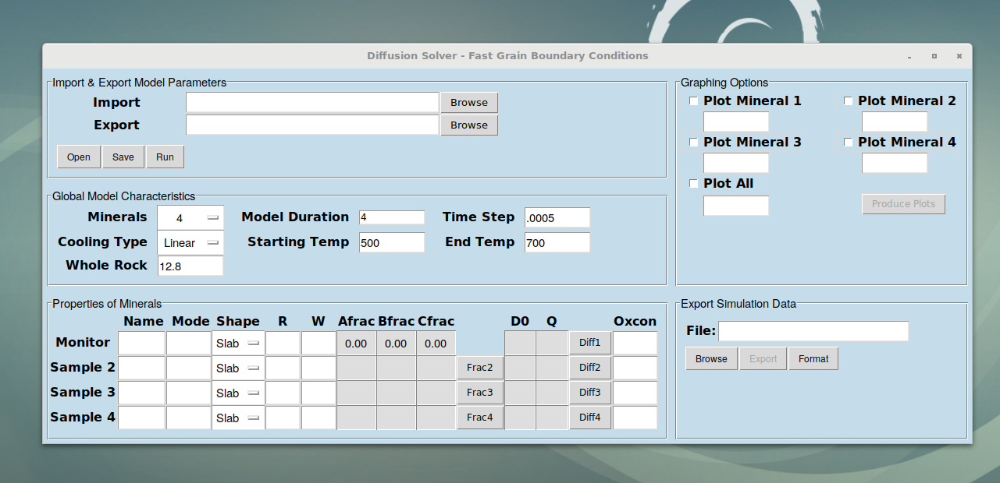
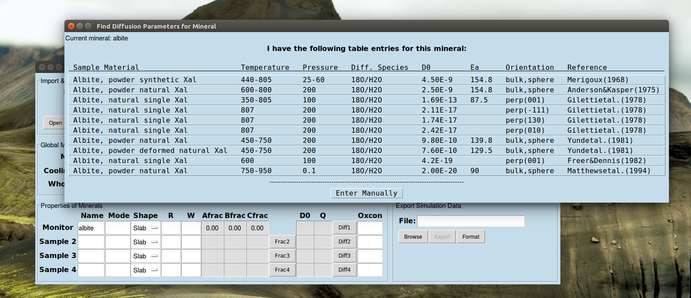
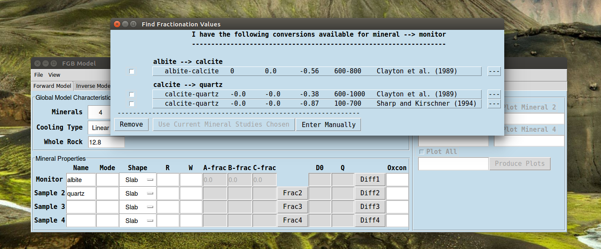
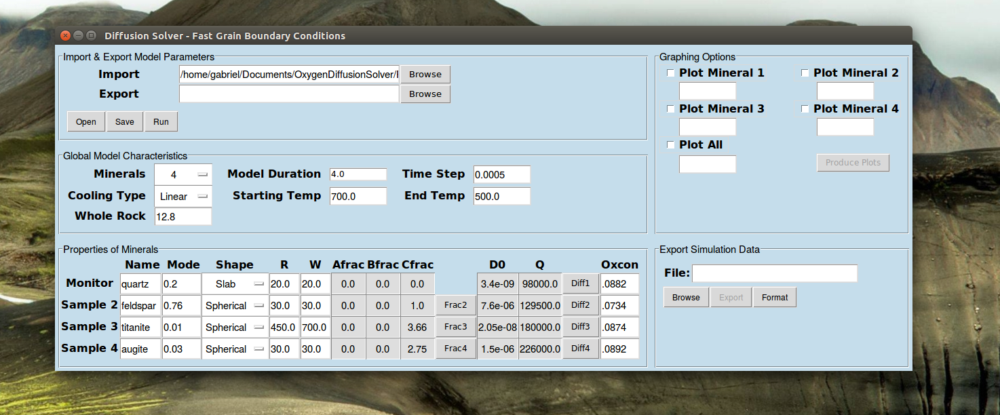
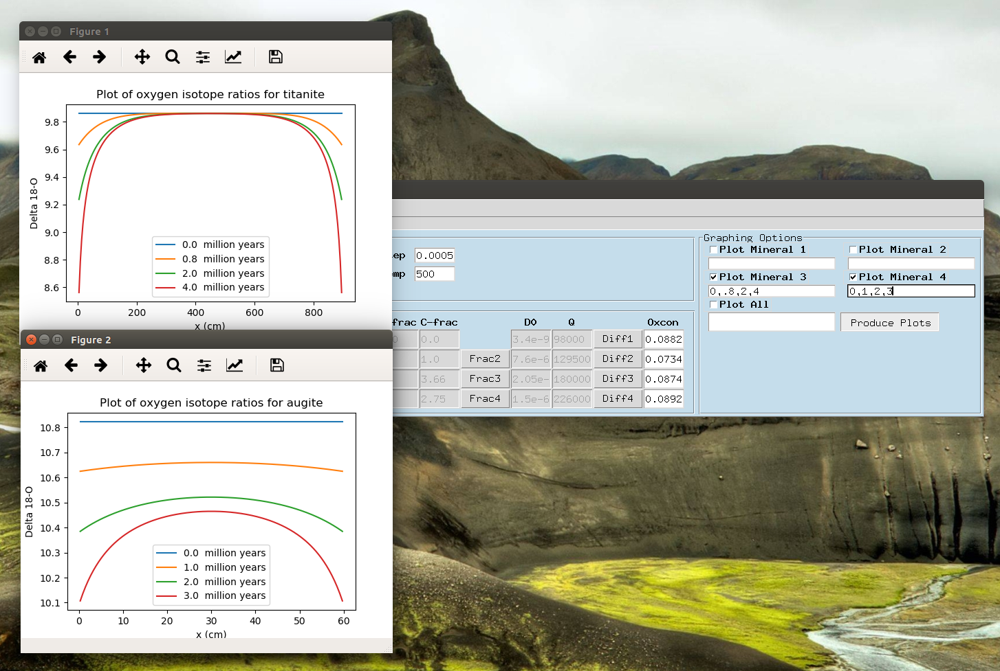

# Oxygen Isotope Diffusion Solver

This python code solves the Fast Grain Boundary (FGB) model for isotope diffusion. It provides a GUI interface for inputing all mineral parameters and provides several graphing options along with the option to export the model solution data to a .csv file. Search menus are provided for convenient referencing of diffusion parameters and fractionation factors.

## Getting Started

These instructions will get you a copy of the project up and running on your local machine and walk you through an example set up of the model parameters.

### Prerequisites

For this code to run you will need to have python 3 installed on your computer along with the following packages for it: tkinter, numpy, matplotlib, and pandas. We recommend using the Anaconda distribution of python as it comes with all the neccessary packages and runs on Intel's proprietary Math Kernel Library blas so that all computations are performed as quickly as possible. Installation instructions can be found at https://docs.anaconda.com/anaconda/install/.

### Installing & Running

First download the files DiffusionSolver.py, FractionationFactorsR.csv, and ODiffusionR.csv. Make sure to place all files in the same folder. Additionally, you can download FGB_03S1T1_Params.txt as it contains an example of saved model parameters and will allow you to check that the code is running correctly.

Next we need to open a live terminal and navigate to the folder containing DiffusionSolver.py. On Mac and Linux this is done by simply typing "Terminal" into the application search bar. On windows search for 'cmd.' The command cd can be used to change your current folder and ls (Linux, Mac) or dir (Windows) can be used to list the available subfolders to navigate to. Once your in the folder containing DiffusionSolver.py run the code by using the commmand python3, as this will ensure the code is run with the appropriate version. Alternatively you can use an IDE such as Pycharm, or Spyder for Mac.

```
usr>: cd Documents
usr>/Documents: cd OxygenDiffusionSolver
usr>/Documents/OxygenDiffusionSolver: python3 DiffusionSolver.py
```
This should open the following pop-up:


### Inputing Model Parameters

After the GUI popups we will need to input both the general model parameters and the mineral-specific parameters. Most of these are fairly self explanatory. First we will set the number of minerals to four, the current version allows for any number between two and eight. Next, we will select a linear cooling type; this creates a cooling history where temperature is proportional to time. With this we will need to specify the starting and ending temperatures, and the time duration of this cooling. There is also an inverse cooling option (temperature inveresly proportional to time), and a custom option. The custom option will ask for a comma-delimited text file containing times in the first column and cooling rates for that corresponding length of time in the second column. All times are in millions of years, and all temperatures are in Celsius unless otherwise stated. We will also need to specify the crushed whole rock delta-18O of our sample. If at any point you are unclear of the units or meaning of a button/entry, simply hover over it with your mouse and a tool-tip should pop up with a brief explanation.

After putting in the general model parameters you should have the following screen:


To input diffusion parameters simply type in the name of your mineral, and then click the corresponding 'Diff' button. This should cause the following menu to pop-up. 


You can select from the any of the current options or enter manually. Similarly for fractionation factors, enter the name of your mineral and the monitor mineral and the program will look for any chain of references that will relate the two. If there are multiple options for any step then the program will allow you to select which one to use.



Finally, after putting in the modes (mole fractions), mineral radii and widths, and the shape paramters describing the diffusion geometry, you should have the following.



To save the model parameters click on the 'Browse' inline with 'Export'. After selecting the file location, click the 'Save' button between 'Open' and 'Run' to actually save the parameters to the selected file. Now in the future you can use the import browse and open buttons to reload the parameters. Now click run and the program will begin, the model simulation will take 10-30 seconds depending on your system. After the simulation is complete you can plot any minerals delta-18 values at any time, or save the entire simulation to a csv file. If you've used the parameters from importing FGB_03S1T1_Params.txt you should get the following plots. 



