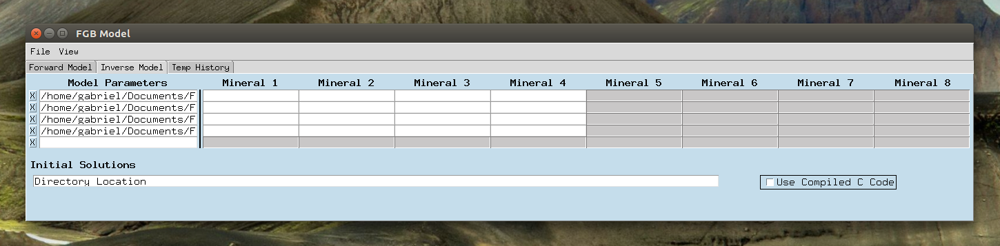
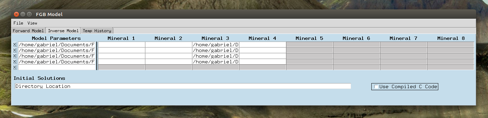
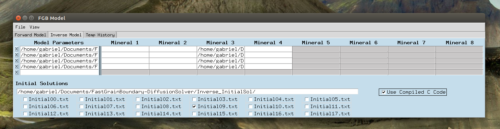
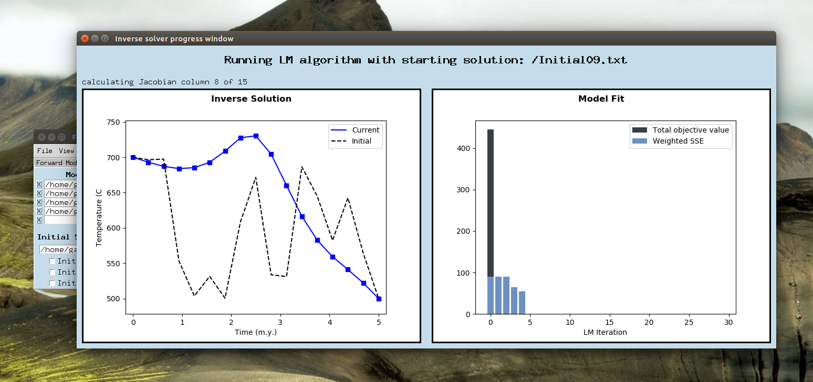

This is the up-to-date fork of the FGB model. You can find the original fork from Gabriel Kropf here: https://github.com/gkropf/FastGrainBoundary-DiffusionSolver

# Oxygen Isotope Diffusion Solver

This application simulates the Fast Grain Boundary (FGB) model for isotope diffusion. It provides a GUI interface for inputing all mineral parameters and provides several graphing options along with the ability to export the model solution data to a .csv file. Search menus are provided for convenient referencing of diffusion parameters and fractionation factors. 

Additionally, the application is equipped with an inversion scheme that can be used to recover thermal histories of mineral samples using isotope zoning profiles. This allows the recovery of high temperature histories not achievable with other commercially available software packages such as HeFTy and QtQt.

For a complete description of the model and detailed analysis of the inverse techniques involved, please see the author's thesis entitled "THERMAL HISTORY INVERSION USING THE FAST GRAIN BOUNDARY MODEL OF DIFFUSION." Paper pending.


## Getting Started

These instructions will get you a copy of the project up and running on your local machine and walk you through an example set up of the model parameters.

### Dependencies

For this code to run you will need to have python 3 installed on your computer along with the following packages for it: tkinter, numpy, scipy, matplotlib, pandas, glob, and os. We recommend using the Anaconda distribution of python as it comes with all the necessary packages and runs on Intel's proprietary Math Kernel Library blas so that all computations are performed as quickly as possible. Installation instructions can be found at https://docs.anaconda.com/anaconda/install/.

### Installing & Running

First download the entire repository, this will ensure that the hierarchical structure of the code is maintained and sub-dependencies of the code are correctly located. Several sample data sets are include to provide a check that the program is running correctly.

Next we need to open a live terminal and navigate to the folder containing DiffusionSolver.py. On Mac and Linux, this is done by typing "Terminal" into the application search bar. On windows, search for 'cmd.' The command cd can be used to change your current folder and ls (Linux, Mac) or dir (Windows) can be used to list the available sub-folders to navigate to. Once in the folder containing DiffusionSolver.py, run the code by using the command python3, as this will ensure the code is run with the appropriate version. Alternatively you can use an IDE such as Pycharm, or Spyder for Mac.

```
usr>: cd Documents
usr>/Documents: cd FastGrainBoundary-DiffusionSolver
usr>/Documents/FastGrainBoundary-DiffusionSolver: python3 DiffusionSolver.py
```
This should open the following pop-up:


## Using the Forward Model 
The forward model accepts global model parameters, mineral-specific parameters, and an expected time-temperature history for the mineral sample. The model output will be the isotope composition for each mineral grain in our sample.

On the first tab of the application entitled "Forward Model", we will set the number of minerals to four. Current version allows for any number between two and eight. Next, we will select a linear cooling type; this creates a cooling history where temperature is proportional to time. With this we will need to specify the starting and ending temperatures, and the time duration of this cooling. There is also a reciprocal cooling option (temperature inversely proportional to time), and a custom option. The custom option will ask for a comma-delimited text file containing times in the first column and cooling rates for that corresponding length of time in the second column. All times are in millions of years, and all temperatures are in Celsius unless otherwise stated. We will also need to specify the whole rock delta-18O of our sample.

After putting in the general model parameters you should have the following screen:


To input diffusion parameters simply type in the name of your mineral, and then click the corresponding 'Diff' button. This should cause the following menu to pop-up. 


You can select from the any of the current options or enter manually. Similarly for fractionation factors, enter the name of your mineral and the monitor mineral and the program will look for any chain of references that will relate the two. If there are multiple options for any step then the program will allow you to select which one to use.


Finally, after putting in the modes (mole fractions), mineral radii and widths, and the shape parameters describing the diffusion geometry, we have the window shown below. You can use the 'File->Load Parameters' option to import these parameters from the Examples/Ex_Params1.txt file. 


To save the model parameters use the 'File->Save Parameters' button. These saved model files will be used for the inverse solver explained below. Now click 'File->Run' and the program will begin, the model simulation will take 10-30 seconds depending on your system. After the simulation is complete you can plot any minerals delta-18 values at any time, or save the entire simulation to a csv file. If you've used the parameters from importing Examples/Ex_Params1.txt, you should get the following plots by using times 0, .8, 2, 4 for mineral 3 and 0,1,2,3 for mineral 4.


## Using the Inverse Solver
The inverse solver will accept 1-5 files containing saved model parameters created in the previous section. Each file corresponds to a single mineral sample. For each sample, and each mineral grain in that sample, we can then upload a data file containing an isotopic profile and associated uncertainties.

By clicking on the rows of section 'Model Parameters' in the tab 'Inverse Model', we can upload all four of our example of model parameters: Ex_Params1.txt, Ex_Params2.txt, Ex_Params3.txt, Ex_Params4.txt. This will result in the screen:



Each one of these parameter files is setup to simulate the diffusive exchange between four minerals: quartz, feldspar, titanite, and augite. However, for each one we only have data available for the third mineral, titanite. Thus, we will upload our example data Ex_Data1.txt through Ex_Data4.txt, in the top four rows of the column 'Mineral 3.' 



Finally, we will need to select which starting solutions we wish to use for our multi-start Levenberg-Marquardt algorithm. Click on the 'directory location' file dialog and select the Inverse_InitialSol folder. We will then elect to use Initial09.txt as our starting solution.



Finally, we will click File->Run. At each iteration of the process, the left panel will show the initial solution in a black dashed line, and the current solution will be shown in blue. The right panel will show all the past objective values (measure of data fit and smoothness) will be shown in the bar plot on the right.



## Project Support
This material is based upon work supported by the National Science Foundation under Grant Number 1650355.

